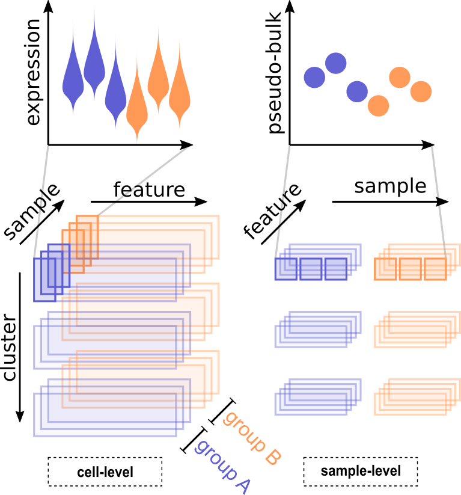

---
author:
- name: Helena L Crowell
  affiliation:
  - &IMLS Institute for Molecular Life Sciences, University of Zurich, Switzerland
  - &SIB Swiss Institute of Bioinformatics (SIB), University of Zurich, Switzerland
  email: helena.crowell@uzh.ch
- name: Charlotte Soneson
  affiliation:
  - Friedrich Miescher Institute, Basel, Switzerland
  - *SIB
- name: Pierre-Luc Germain
  affiliation: 
  - *IMLS
  - *SIB
- name: Mark D Robinson
  affiliation:
  - *IMLS
  - *SIB
date: "`r format(Sys.Date(), '%B %d, %Y')`"
output: 
  bookdown::html_document2:
    highlight: pygments
    toc: true
    toc_depth: 3
vignette: >
  %\VignetteIndexEntry{muscWorkshop}
  %\VignetteEngine{knitr::rmarkdown}
  %\VignetteEncoding{UTF-8}  
bibliography: "`r file.path(system.file('vignettes', package = 'muscWorkshop'), 'refs.bib')`"
---

# Bioconductor 5xx: <br> Analysis of multi-sample <br> multi-group scRNA-seq data

```{r include = FALSE, warning = FALSE, message = FALSE}
knitr::opts_chunk$set(autodep = TRUE, cache = TRUE)
```

## Introduction

### What is DS analysis?

A fundamental task in the analysis of single-cell RNA-sequencing (scRNA-seq) data is the identification of systematic transcriptional changes[@Stegle2015]. Such analyses are a critical step in the understanding of molecular responses, and have applications in development, in perturbation studies or in disease.  
Most of the current scRNA-seq differential expression (DE) analysis methods are designed to test one set of cells against another (or more generally, multiple sets together), and can be used to compare cell clusters (e.g., for identifying marker genes) or across conditions (cells from one condition versus another) [@Soneson2018]. In such statistical models, the cells are the experimental units and thus represent the population that inferences will extrapolate to.

Using established terminology, we refer to cell *identity* as the combination of cell *type*, a stable molecular signature, and cell *state*, a transient snapshot of a cell's molecular events [@Wagner2016; @Trapnell2015]. This classification is inherently arbitrary, but still provides a basis for biological interpretation and a framework for discovering interesting expression patterns from scRNA-seq datasets. For example, T cells could be defined as a single (albeit diverse) cell type or could be divided into discrete subtypes, if relevant information to categorize each cell at this level were available. In either case, the framework presented here would be able to focus on the cell type of interest and look for changes (in expression) across samples.  
Given the emergence of multi-sample multi-group scRNA-seq datasets, the goal becomes making sample-level inferences (i.e., experimental units are samples). Thus, differential state (DS) analysis is defined as following a given cell type across a set of samples (e.g., individuals) and experimental conditions (e.g., treatments), in order to identify cell-type-specific responses, i.e., changes in cell state. DS analysis: i) should be able to detect diluted changes that only affect a single cell type, a subset of cell types or even a subset of a single subpopulation; and, ii) is intended to be orthogonal to clustering or cell type assignment. 

### Starting point

The starting point for a DS analysis is a (sparse) matrix of gene expression, either as counts or some kind of normalized data, where rows = genes and columns = cells. Each cell additionally has a cluster (subpopulation) label as well as a sample label; metadata should accompany the list of samples, such that they can be organized into comparable groups with sample-level replicates (e.g., via a design matrix). 

The approach presented here is modular and thus the type label could originate from an earlier step in the analysis, such as clustering [@Duo2018; @Freytag2018], perhaps after integration  [@Butler2018; @Stuart2018] or after labeling of clusters [@Diaz-Mejia2019] or after cell-level type assignment [@Zhang2019]. Although we have pipelines for these various entry points, the specific details and suitability of all these pre-processing steps needs careful exploration and are beyond the scope of this workflow.

## Getting started

### Data description

To illustrate a standard DS analysis workflow, we will use @Kang2018-demuxlet's droplet-based scRNA-seq data of PBMCs cells from 8 lupus patients measured before and after 6h-treatment with INF-$\beta$ (16 samples in total). The original dataset is deposited under Gene Expression Ombnibus (GEO) accession [GSE96583](https://www.ncbi.nlm.nih.gov/geo/query/acc.cgi?acc=GSE96583), and has been made available via Bioconductor’s `ExperimentHub` web resource as a SingleCellExperiment (SCE) object that contains unfiltered raw counts, and any gene and cell metadata available from the original data source.

### Loading the data

We first initialize a Hub instance to search for and load available data with the `ExperimentHub` function, and store the complete list of records in the variable `eh`. Using `query`, we then retrieve any records that match our keyword(s) of interest, as well as their accession IDs (EH1234).

```{r eh, cache = TRUE, message = FALSE}
library(ExperimentHub)
eh <- ExperimentHub()
query(eh, "Kang")
```

Finally, we load the data of interest into R via `[[` and the corresponding accession ID:

```{r sce, message = FALSE}
(sce <- eh[["EH2259"]])
```

For data handling and visualization throughout this workflow, we will require the following packages:

```{r message = FALSE, warning = FALSE} 
# data handling
library(dplyr)
library(magrittr)
library(Matrix)
library(purrr)
library(reshape2)
library(S4Vectors)
library(tibble)

# visualzation
library(ComplexHeatmap)
library(ggplot2)
library(pheatmap)
library(scales)
```

### Data preparation

Before proceeding with basic preprocessing and filtering steps, we drop non-singlet cells as well as cells that have not been assigned a cluster ID:

```{r}
sce <- sce[, sce$multiplets == "singlet" & !is.na(sce$cell)]
dim(sce)
```

For simplicity, we will further retain only cell-metadata columns that are relevant to our analysis (and use intuitive names for these):

```{r cd}
colData(sce) %>% 
    as.data.frame %>% 
    transmute(
        group_id = stim, 
        patient_id = ind,
        sample_id = paste0(stim, ind),
        cluster_id = cell) %>%
    mutate_all(as.factor) %>% 
    set_rownames(colnames(sce)) %>% 
    DataFrame -> colData(sce)
head(colData(sce))
```

For consistency and easy accession throughout this workflow, we will store cluster and sample IDs, as well as the number of clusters and samples: 

```{r ids}
nk <- length(kids <- set_names(levels(sce$cluster_id)))
ns <- length(sids <- set_names(levels(sce$sample_id)))
```

Finally, we compile a table that summarizes the experimental design:

```{r ei}
m <- match(sids, sce$sample_id)
n_cells <- as.numeric(table(sce$sample_id))
(ei <- data.frame(colData(sce)[m, ], 
    n_cells, row.names = NULL) %>% 
    select(-"cluster_id"))
```

## Preprocessing

The [`scater`](https://bioconductor.org/packages/release/bioc/html/scater.html) package [@McCarthy2017-scater] provides a variey of tools for preprocessing and quality control of single-cell transcriptomic data. For completeness, we will apply some minimal filtering steps to

- remove undetected genes
- remove cells with very few or many detected genes
- remove very lowly expressed genes
- compute normalized expression values for visualization

For more thorough preprocessing, we refer to the [Quality control with *scater*](https://bioconductor.org/packages/release/bioc/vignettes/scater/inst/doc/vignette-qc.html) vignette.

```{r prepro}
# remove undetected genes
sce[rowSums(counts(sce) > 0) > 0, ]
dim(sce)
```

We use `calculateQCMetrics` to compute various quality control metrics for each cell and gene, stored in the `colData` and `rowData`, respectively, and proceed with filtering cells and genes as noted above:

```{r qc}
library(scater)

# calculate quality control (QC) metrics
sce <- calculateQCMetrics(sce)

# get cells w/ few/many detected genes
sce$is_outlier <- isOutlier(
    metric = sce$total_features_by_counts,
    nmads = 2, type = "both", log = TRUE)

# remove outlier cells
sce <- sce[, !sce$is_outlier]
dim(sce)

# remove lowly expressed genes & normalize
sce <- sce[rowSums(counts(sce) > 1) >= 10, ]
dim(sce)
```

Finally, we use `normalize` to calculate log$_2$-transformed normalized expression values by dividing each count by its size factor, adding a pseudo-count of 1, and log-transforming[^1].  

[^1]: Note that, in this workflow, expression values are used for visualization only, and that differential analysis is performed on cluster-sample-level aggregates; see section \@ref(agg).

```{r norm}
sizeFactors(sce) <- librarySizeFactors(sce)
sce <- normalize(sce)
assayNames(sce)
range(logcounts(sce))
```

Alternatively, expression values could be obtained via `vst` (variance stabilizing transformation) from the [`sctransform`](https://github.com/ChristophH/sctransform) package [@Hafemeister2019-vst], which returns Pearson residuals from a regularized negative binomial regression model that can be interpreted as normalized expression values.

## DS analysis

### Aggregation of single-cell to pseudo-bulk data {#agg}

In order to leverage existing robust bulk RNA-seq DE frameworks, such as [`DESeq2`](https://bioconductor.org/packages/release/bioc/html/DESeq2.html), [`edgeR`](https://bioconductor.org/packages/release/bioc/html/edgeR.html) and [`limma`](https://bioconductor.org/packages/release/bioc/html/limma.html), we first aggregate measurements for each cluster at the sample level to obtain pseudobulk data. While, in principle, various combinations of input data (raw/(log-)normalized counts, CPM ect.) and summary statistics (sum, mean, median) could be applied, we here default to the sum of raw counts.

```{r echo = FALSE, out.height = 8, fig.cap = "Aggregation of single-cell to pseudo-bulk data. Cell-level measurements for each subpopulation (cluster) and sample are aggregated to obtain pseudo-bulk data."}
knitr::include_graphics(file.path(system.file("vignettes", package = "muscWorkshop"), "sc-to-pb.png"))
#
```

For aggregation, we use `Matrix.utils`'s `aggregate.Matrix` function with the `colData` columns `"cluster_id"` and `"sample_id"` as `groupings`. Note that `aggregate.Matrix` initially yields a matrix of dimensions #(cluster-sample-instances) $\times$ #(genes), which we re-split and transform to obtain, for each cluster, and matrix of dimensions #(genes) $\times$ #(samples):

```{r pb}
library(Matrix.utils)

system.time({
    # aggregate by cluster-sample
    groups <- colData(sce)[, c("cluster_id", "sample_id")]
    pb <- aggregate.Matrix(t(counts(sce)), 
        groupings = groups, fun = "sum") 

    # split by cluster, transform & rename columns
    pb <- split.data.frame(pb, rep(kids, ns)) %>% 
        lapply(function(u) set_colnames(t(u), unname(sids)))
})
```

From the code snippet above, we obtain a list of length `nk`, where each element contains a `dgCMatrix` of pseudobulk counts with rows = genes and columns = samples. For a more elegant show-method and easier data accession, we construct a SCE where each assay sheet corresponds to one cluster:

```{r}
# construct SCE of pseudo-bulk counts
# (assays = clusters, rows = genes, columns = samples)
(pb <- SingleCellExperiment(assays = pb))
```

The approach used here for aggregation presents but one of many ways, and was selected due to its simplicity and efficiency. Alternatively, one could, for example, split the character vector of cells (`colnames(sce)`) by cluster-sample, and use `rowSums(counts(sce[, ...]))` for aggregation. However, this approach is comparatively more verbose and less efficient[^2]:

[^2]: `sorted = TRUE` in `split()` assures that the order of clusters and samples is consistent for latter column-binding.

```{r}
library(data.table)

system.time({
    # split cell by cluster-sample
    cs_by_ks <- as.data.frame(colData(sce)) %>% 
        rownames_to_column("cells") %>% setDT %>% 
        split(flatten = FALSE, sorted = TRUE,
            by = c("cluster_id", "sample_id")) %>% 
        map_depth(2, "cells")
    
    # for ea. cluster-sample..
    pb2 <- map_depth(cs_by_ks, 2, function(cs)
        rowSums(counts(sce[, cs]))) %>% # ..compute pseudobulks
        map(data.frame) # column-bind samples
})
```

#### Pseudobulk-level MDS plot

Prior to conducting any formal testing, we can compute a multi-dimensional scaling (MDS) plot of aggregated signal to explore overall sample similarities. Ideally, such a represenation of the data should separate both clusters and groups from one another. Vice versa, samples from the same cluster/group should fall close to each other.  
In our MDS plot on pseudobulk counts (Fig. \@ref(fig:mds)), we can appreciate that the horizontal dimension (MDS dim. 1) clearly separates cell-populations (clusters), while control and stimulated samples (groups) are separated vertically (MDS dim. 2).

```{r mds, message = FALSE, fig.cap = "Pseudobulk-level MDS plot. Each point represents one cluster-sample instance; points are colored by cluster ID and shaped by group ID."}
library(edgeR)

# compute MDS coordinates
mds <- as.list(assays(pb)) %>% 
    lapply(as.data.frame.matrix) %>% 
    bind_cols %>% 
    DGEList(remove.zeros = TRUE) %>% 
    calcNormFactors %>% 
    plotMDS.DGEList(plot = FALSE)
    
# prep. data.frame for plotting
gg_df <- data.frame(mds[c("x", "y")],
    cluster_id = rep(kids, each = ns),
    sample_id = rep(sids, nk),
    group_id = ei$group_id[match(sids, ei$sample_id)])

ggplot(gg_df, aes(x, y, col = cluster_id, shape = group_id)) + 
    geom_point(size = 3, alpha = 0.8) +
    labs(x = "MDS dim. 1", y = "MDS dim. 2") + 
    theme(panel.grid.minor = element_blank()) +
    coord_fixed() + theme_bw()
```

#### Cluster-sample cell-counts

While DE analysis is typically used for comparison between cell-types, and may struggle with rare subpopulations, DS analysis compares cluster-sample instances that are likely to be much smaller. Thus, DS analysis may only be applicable to more prominent populations. It is therefore recommended to check cluster-sample cell-counts, and to possibly exclude small instances from downstream analyses. In our example, we might consider, for instance, omitting DS analysis on the "Megakaryocytes" and "Dendritic cells" clusters, as these contain less than 30 cells across almost all samples.

```{r}
options(width = 100)
table(sce$cluster_id, sce$sample_id)
```

### Testing for DS {#DS}

To calculate differential tests, we require a matrix describing the experimental design, and a contrast matrix specifying the comparison of interest, i.e., the combination of model parameters assumed to equal zero under the null hypothesis. 

Design and contrast matrices of appropriate format can be created using the `model.matrix` (`stats` package) and `makeContrast` function (`limma` package), respectively. For clarity, we also set the dimension names of the design matrix (though this is not required by `edgeR`).

```{r ds, message = FALSE}
library(limma)

# construct design & contrast matrix
(design <- model.matrix(~ 0 + ei$group_id) %>% 
    set_rownames(ei$sample_id) %>% 
    set_colnames(levels(ei$group_id)))
(contrast <- makeContrasts("stim-ctrl", levels = design))

# for ea. cluster, run edgeR w/ default parameters
res <- lapply(kids, function(k) {
    y <- assays(pb)[[k]]
    y <- DGEList(y, remove.zeros = TRUE)
    y <- calcNormFactors(y)
    y <- estimateDisp(y, design)
    fit <- glmQLFit(y, design)
    fit <- glmQLFTest(fit, contrast = contrast)
    topTags(fit, n = Inf, sort.by = "none")$table %>% 
        dplyr::mutate(gene = rownames(.), cluster_id = k) %>% 
        dplyr::rename(p_val = PValue, p_adj = FDR)
})
```

### Results filtering & overview

To get a general overview of the differential testing results, we first filter them to retain hits with $\text{FDR}<5\%$ and $~|~logFC~|~>1$, and count the number of differential findings by cluster.

```{r}
# filter FDR < 0.05, |logFC| > 1 & sort by FDR
res_fil <- lapply(res, 
    function(u)  u %>% 
        dplyr::filter(p_adj < 0.05, abs(logFC) > 1) %>% 
        dplyr::arrange(p_adj))

# nb. & % of DE genes per cluster
n_de <- vapply(res_fil, nrow, numeric(1))
cbind(n_de, p_gs = n_de / nrow(sce) * 100)
```

### Between-cluster concordance

DS analysis aims at identifying cell-type-specific changes (in expression) across conditions. In this setting, key questions of interest arise, e.g., which genes are DE in only a single (or very few) clusters? How many DE genes are shared between clusters? In summary, what is the general concordance in differential findings between clusters?  

To gain an impression of the between-cluster (dis-)agreement on DE genes, we generate an upset-plot that visualizas the number of DE genes that are shared across or unique to certain clusters:

```{r fig.width = 8, fig.height = 5}
library(UpSetR)
upset(fromList(map(res_fil, "gene")))
```

From the upset-plot above we can deduce that, for instance, $>150$ of genes are DE across all clusters, about half of CD14+ Monocytes DE genes are unique to that cluster, and that the two Monocytes clusters (FCGR3A+ and CD4+) share the largest set of DE genes ($\approx350$), ect..

## Visualization

### Dimension reduction

One of the most popular plots for representing single-cell data are t-SNE plots, where each cell is represented in a lower, usually two-dimensional, space computed using t-stochastic neighbor embedding (t-SNE).

Dimensionality reductions available within our SCE can be accessed via `reducedDims` from the `scater` package, and visualized using `plotReducedDim`. For our dataset, the t-SNE colored by cluster IDs (Fig. \@ref(fig:tsne); left) shows that cell-populations are well-separated from one another. INF-$\beta$ stimulation manifests as a severe shift in the t-SNE projection of cells (Fig. \@ref(fig:tsne); right), indicating widespread, genome-scale transcriptiontal changes. 
```{r tsne, fig.show = 'hold', out.width = '50%', fig.cap = "t-SNE colored by cluster ID (left) and group ID (right), respectively."}
# t-SNE colored by cluster ID
plotReducedDim(sce, use_dimred = "TSNE", 
    colour_by = "cluster_id", point_size = 0.8, point_alpha = 0.4) + 
    guides(fill = guide_legend(override.aes = list(alpha = 1, size = 5)))

# t-SNE colored by group ID
plotReducedDim(sce, use_dimred = "TSNE", 
    colour_by = "group_id", point_size = 0.8, point_alpha = 0.4) + 
    guides(fill = guide_legend(override.aes = list(alpha = 1, size = 5)))
```

Another nonlinear dimensionality reduction technique, uniform manifold approximation and projection (UMAP), has recently been directly compared to t-SNE, and shown to outperform t-SNE in runtime, reproducibility, and its ability to organize cells into meaningful clusters.  
Besides those already available, we can compute additional dimension reductions (Dr) using `scater`'s `runDR` functions, where `DR` may be any of `PCA`, `MDS`, `TSNE`, `UMAP` or `DiffusionMap`, and visualize these as above:

```{r eval = FALSE}
sce <- runUMAP(sce)
plotReducedDim(sce, use_dimred = "UMAP")
```

### Cell-level visualization {.tabset}

For changes of high interest, we can view the cell-level expressions of specific genes in a specific cluster and across samples. The top-hits for each cluster can be pulled as follows:

```{r warning = FALSE}
# pull top-n genes for ea. cluster
top_gs <- lapply(res_fil, function(u) u$gene[seq_len(9)])
```

We use `scater::plotExpression` to generate violin plots for the top differential genes identified for each cluster, specifying `x = "sample_id"` to obtain one violin per sample, and `colour_by = "group_id"` to highlight the experimental condition each sample belongs to.

Note that, as we are testing for DE on the cluster-level, for plotting, we need to subset the cells that have been assigned to a given cluster `k`. To this end, we first split the character vector of cells `colnames(sce)` by the `colData` column `"cluster_id"`:

```{r eval = FALSE}
# split cells by cluster
cs_by_k <- split(colnames(sce), sce$cluster_id)

lapply(kids, function(k) {
    gs <- top_gs[[k]]  # get top gene-hits for cluster k
    cs <- cs_by_k[[k]] # subset cells assigned to cluster k
    plotExpression(sce[, cs], features = gs, 
        x = "sample_id", colour_by = "group_id", ncol = 3) +
        guides(fill = guide_legend(override.aes = list(size = 5, alpha = 1))) +
        theme_classic() + theme(axis.text.x = element_text(angle = 45, hjust = 1))
})
```

```{r violins, echo = FALSE, results = "asis", fig.width = 12, fig.asp = 2/3, fig.cap = "Violin plots. Shown are the top-9 (lowest adj. p-value) differential genes in each cluster.<br>x-axis = samples, y-axis = expression (log-normalized counts). Cells are colored by group ID."}
cs_by_k <- split(colnames(sce), sce$cluster_id)
for (k in kids) {
    cat("####", k, " {-}\n")
    p <- plotExpression(sce[, cs_by_k[[k]]], features = top_gs[[k]] , 
        x = "sample_id", colour_by = "group_id", ncol = 3) +
        guides(fill = guide_legend(override.aes = list(size = 5, alpha = 1))) +
        theme_classic() + theme(axis.text.x = element_text(angle = 45, hjust = 1, vjust = 1))
    print(p)
    cat("\n\n")
}
```

### Sample-level visualization {.tabset}

Especially when wanting to gain an overview of numerous DE testing results for many clusters, both dimension reduction and cell-level visualisations require a lot of space and can become cumbersome to interpret. In this setting, it is thus recommendable to visualise aggregated measurements, e.g., mean expression values by cluster and sample. 

We can assemble cluster-sample expression-means by specifying `fun = "mean"` and replacing `counts` with `logcounts` in the code snipped used to compute pseudobulk-counts in section \@ref(agg):

```{r ms}
# calculate expression-means by cluster-sample
ms <- aggregate.Matrix(t(logcounts(sce)), 
    groupings = groups, fun = "mean") %>% 
    split.data.frame(rep(kids, ns)) %>% 
    lapply(function(u) set_colnames(t(u), unname(sids))) %>% 
    SingleCellExperiment(assays = .)
```

To better highlight relative differences across conditions, we construct the helper-function `.z_norm` that applies a z-normalization to normalize expression values to mean 0 and standard deviation 1:

```{r}
.z_norm <- function(x, th = 2.5) {
    x <- as.matrix(x)
    sds <- rowSds(x, na.rm = TRUE)
    sds[sds == 0] <- 1
    x <- t(t(x - rowMeans(x, na.rm = TRUE)) / sds)
    #x <- (x - rowMeans(x, na.rm = TRUE)) / sds
    x[x >  th] <-  th
    x[x < -th] <- -th
    return(x)
}
```

We further construct the wrapper `.plot_diff_hm` that takes as input a SCE of pseudobulk mean-logcounts, a cluster ID `k`, a character string of genes `gs`, and an experimental design table `ei`:

```{r}
.plot_diff_hm <- function(ms, k, gs, ei) {
    mat <- assays(ms)[[k]][gs, ]
    m <- match(colnames(mat), ei$sample_id)
    cols <- hue_pal()(nlevels(ei$group_id))
    names(cols) <- levels(ei$group_id)
    col_anno <- columnAnnotation(
        df = data.frame(group_id = ei$group_id[m]),
        col = list(group_id = cols),
        gp = gpar(col = "white"),
        show_annotation_name = FALSE)
    Heatmap(.z_norm(mat), 
        column_title = k,
        name = "z-normalized\nexpression",
        col = c("royalblue", "cornflowerblue", "white", "gold", "orange"),
        cluster_rows = FALSE,
        cluster_columns = FALSE,
        row_names_side = "left",
        rect_gp = gpar(col = "white"),
        top_annotation = col_anno)
}
```

`.plot_diff_hm` uses the [`ComplexHeatmap`](https://bioconductor.org/packages/release/bioc/html/ComplexHeatmap.html) package to render a heatmap of z-normalized mean expressions (for a given cluster) across samples such that rows = genes, columns = samples, and columns are annotated with group IDs. We can visualize the top-20 differential findings in each cluster as follows: 

```{r eval = FALSE}
lapply(kids, function(k) {
    top20 <- res_fil[[k]]$gene[seq_len(20)] # subset top-20 hits for cluster k
    .plot_diff_hm(ms, k, top20, ei)         # render differential heatmap
})
```

```{r diff-hm, echo = FALSE, results = "asis", fig.cap = "Differential heatmap. Shown are the top-20 (lowest adj. p-value) genes identified as differential in each cluster.<br>Coloring represents z-normalized cluster-sample expression means."}
for (k in kids) {
    cat("####", k, " {-}\n")
    top20 <- res_fil[[k]]$gene[seq_len(20)]
    print(.plot_diff_hm(ms, k, top20, ei))
    cat("\n\n")
}
```

## DA analysis

Differential abundance (DA) analysis compares the proportions of cell types across experimental conditions and aims to highlight populations that are present at different ratios. Even though DA analysis lies beyond the scope of this workflow, we present it here for completeness.

In preparation for DA analysis, we first calculate two tables that contain cell counts for each sample and population (`n_cells`) and the corresponding proportions of cell types by sample (`freqs`)[^3]:

[^3]: Proportions are used for plotting only; statistical modeling takes cluster-sample cell counts as input; see section \@ref(DA).

```{r}
# calculate cluster-sample cell counts
n_cells <- table(sce$cluster_id, sce$sample_id)

# calculate cluster proportions across samples
freqs <- prop.table(n_cells, margin = 1)
```

### Visualization

For visual inspection, we generate a barplot of cell type compositions for each sample; see Fig. \@ref(fig:da-barplot). As alternative represenation, we further render a boxplot where each panel compares the distribution of a given subpopulation's frequencies between groups; see Fig. \@ref(fig:da-boxplot). 

```{r}
# prep. data.frame for plotting
df <- data.frame(
    frequency = as.numeric(freqs), 
    cluster_id = rep(kids, ns),
    sample_id = rep(sids, each = nk))
m <- match(df$sample_id, ei$sample_id)
df$group_id <- ei$group_id[m]
```

```{r da-barplot, fig.width = 6, fig.asp = 2/3, fig.cap = "Barplot of subpopulation frequencies; stratified by group ID."}
# barplot of relative cluster-abundances
ggplot(df, aes(x = sample_id, y = frequency, fill = cluster_id)) +
    geom_bar(stat = "identity", position = "fill") + 
    facet_wrap(~ group_id, scales = "free_x") +
    theme_classic()  + theme(axis.text.x = element_text(angle = 45, hjust = 1))
```

```{r da-boxplot, fig.width = 8, fig.asp = 2/3, fig.cap = "Boxplot of subpopulation frequencies; stratified by cluster ID."}
# boxplot of relative cluster-abundances
ggplot(df, aes(x = group_id, y = frequency, color = group_id)) +
    geom_boxplot(outlier.colour = NA) +  geom_jitter() +
    facet_wrap(~ cluster_id, scales = "free_y", ncol = 4) +
    theme_classic()
```

### Testing for DA {#DA}

For differential testing, we reuse the design and contrast matrix from section \@ref(DS). In agreement with the results reported by @Kang2018-demuxlet, we find that INF-$\beta$ treatment does not significantly affect cell type proportions between control and stimulated cells, with the most prominent increase being in the frequency of "Dendritic cells" (logFC $\approx 0.71$): 

```{r}
y <- DGEList(counts = n_cells)
y <- estimateDisp(y, design, trend.method = "none")
fit <- glmFit(y, design)
fit <- glmLRT(fit, contrast = contrast)
topTags(fit, n = Inf)$table %>% round(2)
```

## Geneset enrichment analysis

Functionally related genes or pathways can be grouped together in so-called *genesets*. Geneset enrichment analysis (GSEA) aims at identifying genesets that are up- or downregulated in one experimental condition or group versus another, in order to unravel their association with, e.g., disease.

### Organize genesets & names

The [Molecular Signature Database](http://software.broadinstitute.org/gsea/msigdb/collection_details.jsp) provides a detailed list of geneset collections for GSEA. Using the `msigdbr` function, we can retrieve genesets that are of interest for our dataset, namely:

- hallmark genesets `"H"`
- curated genesets `"C2"` (among others, contains sets derived from the KEGG pathway database that includes pathways associated with immune disease, specifically, Systemic lupus erythematosus)
- immunologic signatures `"C7"` (since Lupus is an autoimmune disease)

```{r}
# retrieve gene sets
# - H:  hallmark genesets
# - C2: curated genesets
# - C7: immunological signatures
library(msigdbr)
(msigdbr(
    species = "Homo sapiens",
    category = c("H", "C2", "C7")) %>% 
    # MSigDB gene symbols are non-capitalize;
    # we use `toupper` to match symbols 
    # with those contained in our dataset
    mutate_at("gene_symbol", toupper) -> m_df) %>% head
```

Ensembl IDs and gene symbols are stored in our SCE's `rowData`. We add these to the DS analysis result tables, and do a spot-check to summarize how many genes of the above genesets are contained in our dataset. Additionally, we filter for genesets that comprise at least 20 and at most 1000 genes: 

```{r}
# add gene info to DS result tables
res <- lapply(res, function(u) {
  u$ensembl_id <- rowData(sce)[u$gene, "ENSEMBL"]
  u$symbol <- rowData(sce)[u$gene, "SYMBOL"]
  return(u)
})

# spot-check
sapply(res, function(u) table(u$symbol %in% m_df$gene_symbol))

# filter for set sizes of 20-1000
sets <- split(m_df$gene_symbol, m_df$gs_name)
n <- vapply(sets, length, numeric(1))
sets <- sets[n >= 20 & n < 1000]
length(sets)
```

### Run `camera` on ea. cluster

```{r}
gs_dat <- lapply(kids, function(k) {
    inds <- ids2indices(sets, res[[k]]$symbol, remove.empty = TRUE)
    dat <- assays(pb[res[[k]]$gene, ])[[k]]
    v <- voom(dat, design)
    f <- lmFit(v, design)
    f <- eBayes(f)
    cf <- contrasts.fit(f, contrast)
    cf <- eBayes(cf)
    list(indices = inds, voom = v, cluster_id = k, contrasts.fit = cf)  
})

# construct data.frame
gs_df <- lapply(gs_dat, function(u)
    camera(u$voom, u$indices, design, contrast) %>% 
        rownames_to_column("geneset")) %>% 
    bind_rows(.id = "cluster_id")
```

### Heatmap summary

```{r fig.width = 14, fig.asp = 2/3}
cats <- gs_df %>% 
    dplyr::filter(FDR < 1e-20) %>%
    pull(geneset) %>% unique
length(cats)

gs_df %>% 
    dplyr::filter(geneset %in% cats) %>%
    dplyr::mutate(neg_log10_fdr = -log10(FDR)) %>% 
    acast(cluster_id ~ geneset, value.var = "neg_log10_fdr") %>% 
    set_colnames(strtrim(colnames(.), 30)) %>% 
    pheatmap
```

### Barcode plots {.tabset}

A common visualization of GSEA results are so-called *barcode plots*. These plots the position of a geneset in a ranked list of test statistics, thereby showing the enrichment of a gene set amongst high or low ranked genes. Statistics are ranked left to right from smallest to largest, with the positions of the specified geneset marked by vertical bars, forming a pattern like a barcode. Here, an accumulation of lines on the left-hand side corresponds to a set of down-regulated genes, and vice versa.

```{r results = "asis", fig.width = 6, fig.height = 4}
cats_by_cluster <- gs_df %>% 
    group_by(cluster_id) %>% 
    top_n(5, -FDR) %>% 
    group_split %>% 
    set_names(kids) %>% 
    lapply(pull, geneset)

lapply(kids, function(k) {
    cat("#### ", k, "{-}\n")
    lapply(cats_by_cluster[[k]], function(c)
        barcodeplot(
            statistics = gs_dat[[k]]$contrasts.fit$t[, 1],
            index = gs_dat[[k]]$indices[[c]],
            quantiles = c(-1, 1) * qt(0.95, df = 14),
            main = c, cex.main = 0.8))
    cat("\n\n")
})
```

## Concluding remarks

We have worked through a complete analysis of an examplary multi-sample multi-group scRNA-seq dataset. While the pipeline presented here is, in general, transferable to any dataset of similar experimental design, many analysis steps require careful consideration of the data and may need to be modified. Especially the preprocessing steps applied here were held at a minimum, and should be complemented with, e.g., additional visualizations, quality control and filtering steps.

The analyses presented here are **ongoing work**. We are in the process of finalizing the `muscat` R package (multi-sample multi-group scRNA-seq analysis tools), that implements a flexible aggregation wrapper, visualization tools, as well as sample-level (aggregation-based) and cell-level (mixed-models-based) approaches for DS analysis. A current under-development version of `muscat` is available at http://github.com/HelenaLC/muscat; we hope to make the package available with Bioconductor's next release.

## References {-}